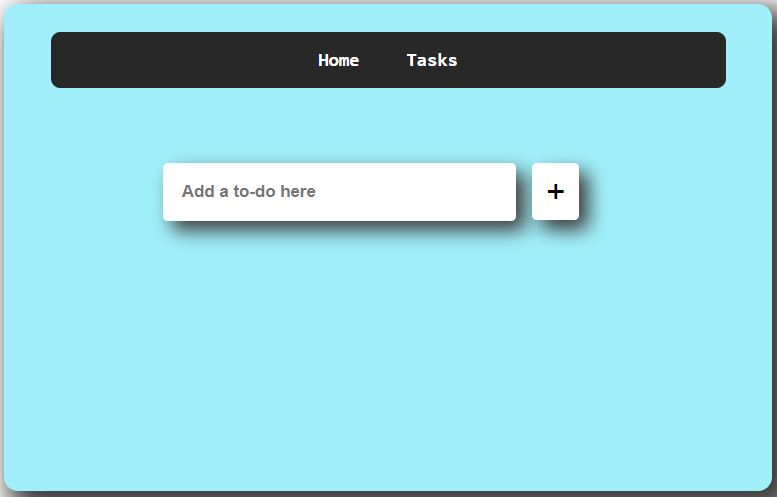
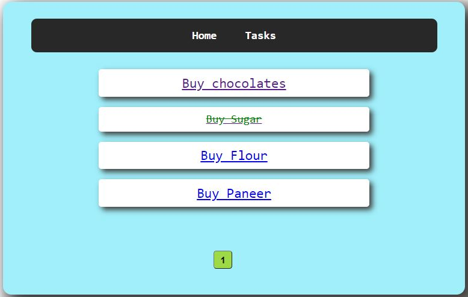
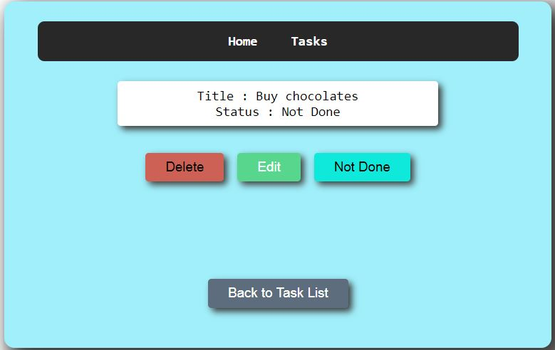

# TODO-application

## Description:
A simple TODO application created using React, React-routing and mock server. User can add, edit, toggle the status as well as delete any task at any given time.

## Technologies used:
* HTML
* CSS
* Javascript
* React

# UI:
### Home Page:

### Tasks Page:

### Task Page:

